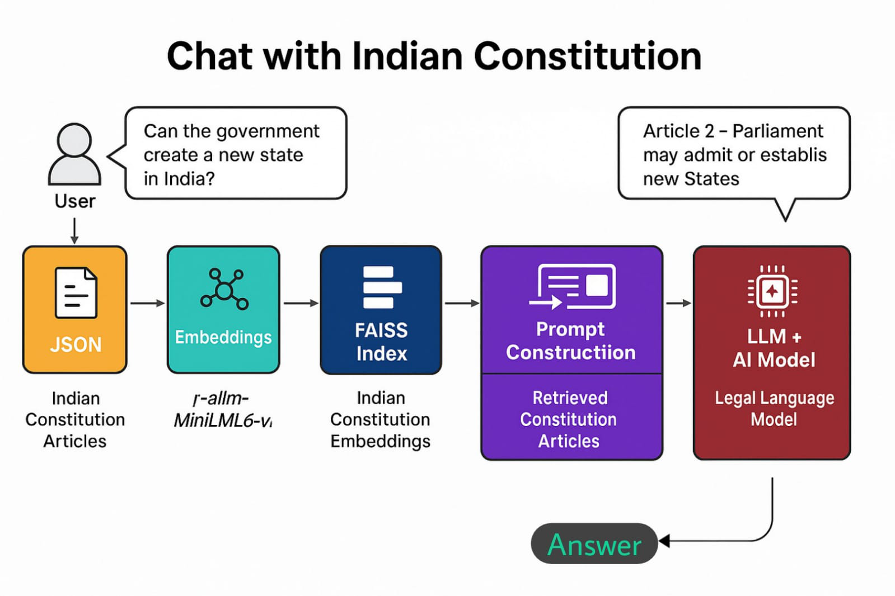
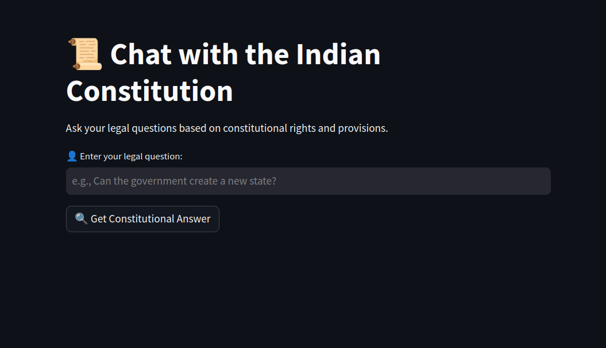
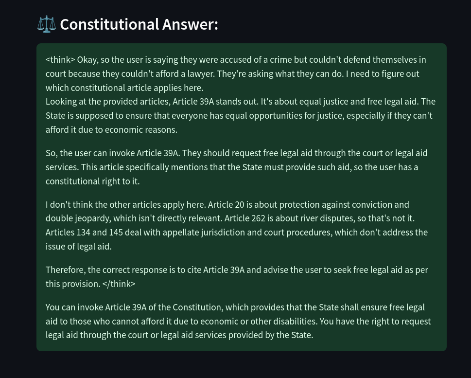

# 🧠🇮🇳 Indian_Constitution_Chatbot

**An AI-powered Legal Assistant for India's Constitution**  
[](https://github.com/abhiseksarkar2001/Indian_constitution_chatbot)

---

## 🏛️ Overview

**Indian_Constitution_Chatbot** is a Retrieval-Augmented Generation (RAG) powered virtual assistant that helps Indian citizens understand their **constitutional rights and legal provisions** directly from the **Constitution of India**.

Using state-of-the-art **NLP techniques**, this chatbot searches the Constitution for relevant articles and provides **legally accurate, concise responses**. It's built using a **FAISS-based semantic search engine**, combined with **Groq’s LLMs**, and deployed via a user-friendly **Streamlit** interface.

> ⚖️ *Not a substitute for a lawyer. It is a free, informative tool to understand the legal context from the Indian Constitution.*

---

## 📜 About the Constitution of India

The **Constitution of India** is the **supreme legal document** of the country. Enacted in 1950, it outlines:
- Fundamental rights and duties of citizens,
- Directive principles of state policy,
- Governance structure and distribution of powers between the center and states.

This chatbot helps users **interactively explore** the constitution and get context-based legal answers.

---

## 📂 Data Source

All constitutional data used in this chatbot is sourced from the CivicTech India open-source repository:

🔗 [https://github.com/civictech-India/constitution-of-india/blob/main/constitution_of_india.json](https://github.com/civictech-India/constitution-of-india/blob/main/constitution_of_india.json)

---

## 🔧 RAG Pipeline (Detailed Workflow)

The system uses a **Retrieval-Augmented Generation (RAG)** approach with the following steps:

1. **Data Preparation**  
   - The `constitution_of_india.json` is parsed and preprocessed.
   - Each article's title and description are combined.

2. **Embedding Generation & Indexing**  
   - Using `all-MiniLM-L6-v2`, sentence-level embeddings are generated.
   - A **FAISS index** is created to allow fast semantic search.

3. **Query Handling**  
   - The user’s legal query is embedded.
   - FAISS retrieves the top `k` most relevant constitutional articles.

4. **Prompt Construction**  
   - Retrieved articles are stitched into a legal context.
   - A structured prompt is formed for the language model.

5. **LLM Response**  
   - A **Groq-hosted LLM** (`deepseek-r1-distill-llama-70b`) generates the legal answer using only the retrieved content.

6. **Interface & Display**  
   - A **Streamlit interface** enables interaction.
   - Responses and articles are displayed to the user.

---

### 📊 Pipeline Diagram

🖼️ 

---

## 🖥️ Streamlit Chat Interface

A clean, interactive UI built using **Streamlit** provides the interface for querying the constitution.

🖼️ 

---

## 🚀 How to Run

To start the chatbot interface locally, run:

```bash
streamlit run constitution_chatbot.py
```

The browser interface will launch and allow legal queries interactively.

🖼️ 

---

## 📁 Project Structure

```bash
Indian_constitution_chatbot/
├── constitution_outputs/             # Stores model outputs as .txt files
│   └── constitution_response_*.txt
├── Chat with Indian Constitution.pdf # PDF export of a chat session
├── chat_bot_response.png             # Screenshot of LLM response
├── chatbot_interface.png             # Screenshot of Streamlit interface
├── pipeline.png                      # RAG pipeline visualization
├── command to run the chatbot.txt    # Plaintext run command
├── constitution_chatbot.py           # 🚀 Streamlit chatbot interface
├── Chat_With_Constitution_of_India.py# 🧠 Core CLI-based RAG bot logic
├── Faiss_creator.py                  # ⚙️ Embedding and FAISS index creation
├── faiss_index/                      # 📦 FAISS index binary
├── faiss_index_meta.pkl              # 🧾 Metadata for each embedded article
├── constitution_of_india.json        # 📚 Source text of the Constitution
```

---

## 🧠 Code Overview

- `Faiss_creator.py`:  
  Preprocesses JSON, creates embeddings using `SentenceTransformer`, and builds the FAISS index with metadata.

- `Chat_With_Constitution_of_India.py`:  
  CLI-based legal assistant to retrieve relevant constitutional content and generate answers via Groq’s LLM.

- `constitution_chatbot.py`:  
  Streamlit-based frontend interface for querying the Constitution interactively.

---

## ☁️ About Groq Cloud

Groq provides **high-performance cloud access to LLMs**. We used:
- Model: `deepseek-r1-distill-llama-70b`
- API: Free-tier Groq API key for demo and public deployment.

🔐 Make sure your `GROQ_API_KEY` is set properly inside the Python scripts.

---

## 📦 Requirements

Install all required packages with:

```bash
pip install streamlit faiss-cpu sentence-transformers groq
```

---

## ⚠️ Legal Disclaimer

This chatbot is for **educational and informational purposes only**. It **does not constitute legal advice**, and responses should not be relied upon in any legal proceeding.

---

## 📬 Contact & Contributions

Project by: [Abhisek Sarkar](https://github.com/abhiseksarkar2001)  
Issues and contributions are welcome via [GitHub Issues](https://github.com/abhiseksarkar2001/Indian_constitution_chatbot/issues)

---


